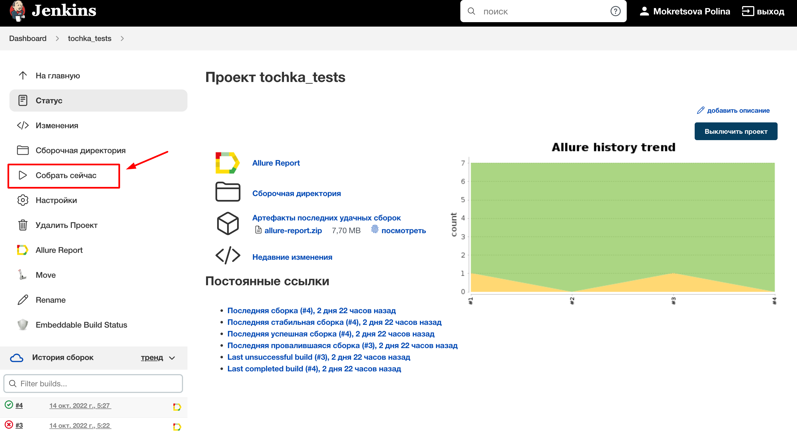
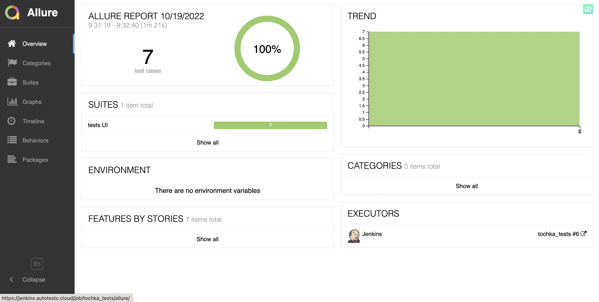
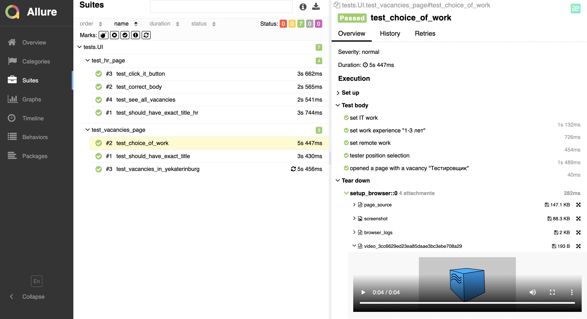
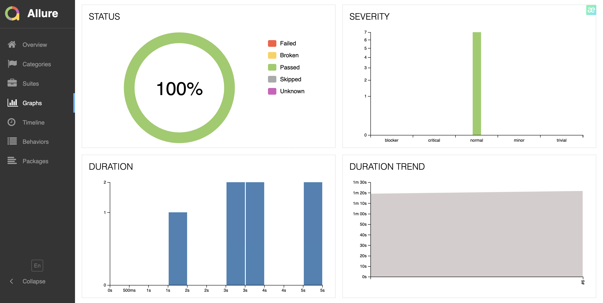
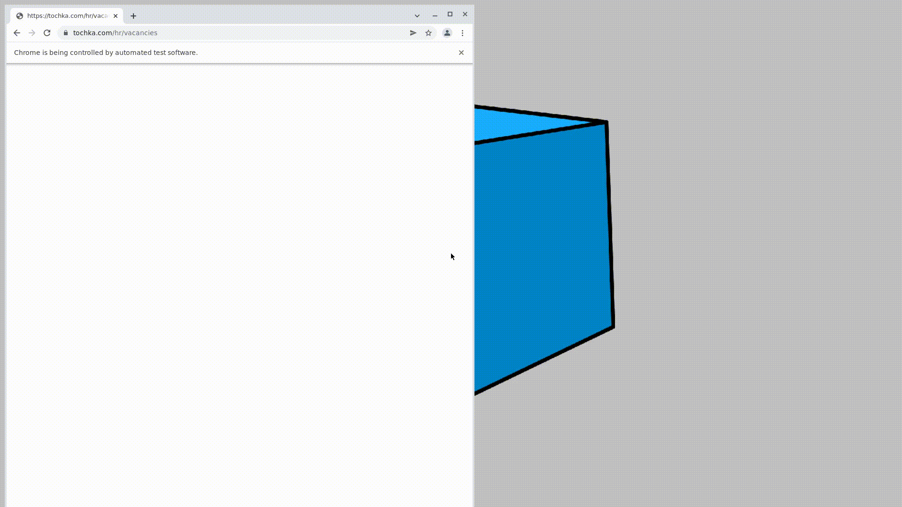
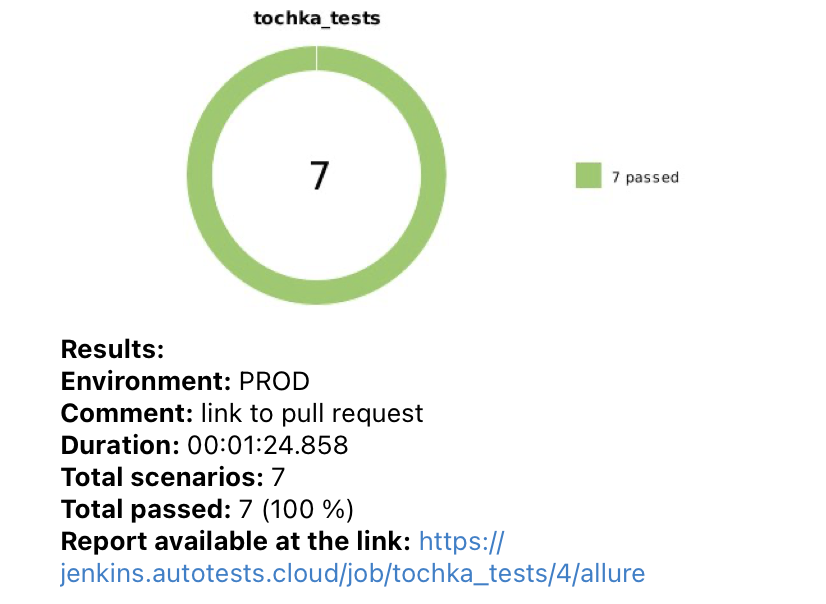

# Проект автотестов на сайт [tochka.com](https://tochka.com/hr/)
Проект автотестов на сайт Точки с вакансиями.

# Оглавление
1. [Технологии](#технологии)
2. [Описание проекта](#описание)
3. [Запуск тестов в jenkins](#запуск_дженкинс)
4. [Результат прохождения тестов в Allure report](#report)
5. [Результаты работы тестов](#видео)
    1. [Пример работы тестов (видео)](#видео)
    2. [Результаты тестов в телеграм](#телеграм)
6. [Allure TestOps](#проект)
    1. [Проект](#проект)
    2. [Интеграция с Jenkins](#интеграция)
    3. [Dashboard](#дашборд)

# Использованны слудующие технологии:

[К оглавлению ⬆](#оглавление)

# Описание проекта
Автоматизирована проверка страницы c вакансиями сайта tochka.com.
Тесты написаны на python с использованием Selene+Pytest. Запуск тестов производится в Jenkins. Для запуска браузеров в контейнерах Docker используется Selenoid. В проекте применен паттерн проектирования
автотестов PageObject.
Для визуализации результатов тестирования используются Allure Report, AllureTestOps и Telegram Bot.

[К оглавлению ⬆](#оглавление)

# Запуск тестов в [Jenkins](https://jenkins.autotests.cloud/job/tochka_tests/) выглядит следующим образом
Главная страница сборки

[К оглавлению ⬆](#оглавление)

# [Отчет](https://jenkins.autotests.cloud/job/tochka_tests/allure/) о выполнении тестов

Каждый тест, независимо от результата, состоит из:
- начальных параметров,
- шагов, 
- скриншота браузера,
- исходного кода страницы,
- лога консоли браузера,
- видео выполнения теста.

Окно с графиками

[К оглавлению ⬆](#оглавление)

# Пример прохождения теста на удаленной машине

[К оглавлению ⬆](#оглавление)

# По результатам работы тестов отправляется краткий отчет в Telegram

[К оглавлению ⬆](#оглавление)

# Создан проект в Allure TestOps
Тесты в проекте импортированы из кода, то есть не приходится писать тесты и автоматизировать их.
Достаточно написать автотест, а кейс в TMS всегда будет в актуальном состоянии. Так же, на проекте есть ручные тесты.

[К оглавлению ⬆](#оглавление)

# Настроена интеграция Jenkins и Allure TestOps
Запуск джоб осуществляется из интерфейса Allure TestOps

Результаты работы джоб также отображаются в Allure TestOps

[К оглавлению ⬆](#оглавление)

# Настроен Dashboard с разными показателями
Отображаются графики тренда автоматизации, последний запуск и т.д.

[К оглавлению ⬆](#оглавление)
